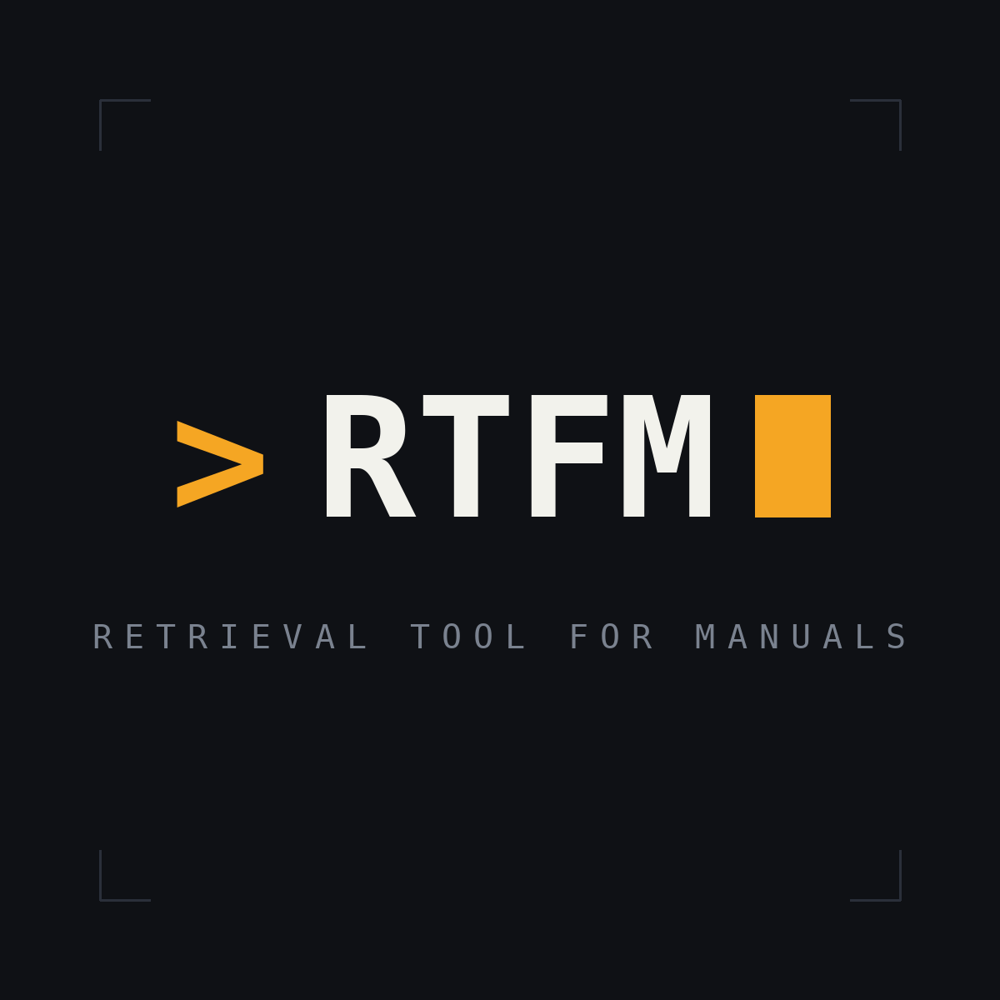

# RTFM

<p align="center">
  
</p>

<p align="center">
  <a href="https://github.com/a7ex-turcan/rtfm/actions/workflows/ci.yml"></a>
  
  
  
  
</p>

**R**etrieval **T**ool **F**or **M**anuals — a local, per-developer documentation
search tool for your LLM.

RTFM indexes a folder of documentation — Confluence exports, Word, Markdown,
PDF, Excel, CSV, draw.io diagrams — into a local
[OpenSearch](https://opensearch.org/) instance and exposes it to any MCP-capable
LLM client (Claude Code, Claude Desktop, IDE integrations) over a stdio
[Model Context Protocol](https://modelcontextprotocol.io/) server. Instead of
manually attaching docs to a chat, you ask your LLM a question and it retrieves
the relevant passages itself.

It's built to answer two kinds of question:

- **Technical lookup** — *"What's the endpoint to GET this resource?"*
  The answer's words are in the docs verbatim (lexical search).
- **Conceptual** — *"What does Bundle mean?"*
  The answer may never repeat your phrasing (semantic search).

Everything runs locally. No external APIs, no per-developer cloud accounts, no
documents leaving your machine.

## How it works

```
docs/          ──►  rtfm (CLI)  ──►  OpenSearch  ──►  rtfm-mcp  ──►  your LLM
(.doc .docx .md     convert · chunk     rtfm-docs      search_docs       client
 .pdf .xlsx .csv    · index               index          + 10 more (MCP)
 .drawio .png .jpg
 .sql .rtfmdb)
```

Three independent processes, each with its own lifecycle:

| Component  | What it is                     | Role                                              |
|------------|--------------------------------|---------------------------------------------------|
| `rtfm`     | Console CLI                    | Converts documents → markdown, chunks, indexes    |
| OpenSearch | Single-node container (Docker) | Persistent search store (`rtfm-docs` index)       |
| `rtfm-mcp` | stdio MCP server               | Exposes `search_docs` & friends to the LLM client |

The CLI converts each document to markdown, splits it into
heading-aware chunks with breadcrumb context, and bulk-indexes them. Retrieval
is **hybrid + reranked**: a tuned BM25 lexical search (excellent for technical
lookups) fused with local in-process semantic embeddings, then the shortlist is
reordered by a local cross-encoder for precision. Both models (all-MiniLM +
ms-marco-MiniLM via ONNX Runtime, ~90 MB each) auto-download once and cache per
user; without them search degrades gracefully tier by tier. See
[`CLAUDE.md`](./CLAUDE.md) for the full design and rationale.

## Requirements

- [.NET 10 SDK](https://dotnet.microsoft.com/)
- [Docker](https://www.docker.com/) (Docker Desktop on macOS/Windows; on native
  Linux also set `vm.max_map_count=262144` so OpenSearch will start)
- An MCP-capable LLM client (e.g. Claude Code)

Runs on Windows, macOS, and Linux.

## Getting started

The 60-second tour below works from the repo root on any OS. For a full
per-machine setup — commands on PATH, persistent env vars, Claude Code wiring —
follow [Windows local setup](#windows-local-setup) or
[macOS local setup](#macos-local-setup).

```bash
# 1. Start the local search store
docker compose up -d

# 2. Build
dotnet build -c Release

# 3. Confirm the CLI can reach OpenSearch
dotnet run --project src/Rtfm.Cli -- ping

# 4. Index your documentation (first run downloads the embedding model, ~90 MB)
dotnet run --project src/Rtfm.Cli -- index ./docs

# 5. Search it from the CLI
dotnet run --project src/Rtfm.Cli -- search "how are roles mapped to functions"

# 6. (optional) Keep the index fresh as docs change
dotnet run --project src/Rtfm.Cli -- watch ./docs
```

## Install as a .NET global tool

RTFM ships as two [.NET global tools](https://learn.microsoft.com/dotnet/core/tools/global-tools):
`rtfm` (the CLI — package `Rtfm.Cli`) and `rtfm-mcp` (the MCP server — package
`Rtfm.Mcp`). **Install both** — they're separate packages (.NET tools don't
chain-install), and you need each: `rtfm` to `init`/`index` your local corpus,
`rtfm-mcp` for the LLM client to spawn.

```bash
dotnet tool install -g Rtfm.Cli
dotnet tool install -g Rtfm.Mcp
```

That puts both commands on your PATH (via `~/.dotnet/tools`) on every OS — no
cloning, no manual PATH or `RTFM_HOME` for the binaries. You still need Docker +
OpenSearch (`rtfm init` bootstraps the container) and the .NET 10 runtime. The
OCR models and every platform's native runtime (ONNX Runtime, SkiaSharp,
SqlClient) are bundled inside each package, so an installed tool is
self-contained — only the embedding/reranker models auto-download on first
`index`/`search` (~90 MB each, cached per user). Update with `dotnet tool update
-g Rtfm.Cli`; remove with `dotnet tool uninstall -g Rtfm.Cli` (same for
`Rtfm.Mcp`).

<details>
<summary><b>Install from source instead</b> (while iterating on RTFM itself)</summary>

```bash
dotnet pack src/Rtfm.Cli -c Release
dotnet pack src/Rtfm.Mcp -c Release       # stop any running rtfm-mcp first — it locks the DLL
# → artifacts/nupkg/*.nupkg
dotnet tool install -g Rtfm.Cli --add-source ./artifacts/nupkg
dotnet tool install -g Rtfm.Mcp --add-source ./artifacts/nupkg
```
</details>

**Then bootstrap and use it from anywhere:**

```bash
rtfm init                       # start OpenSearch + create the index
rtfm index ~/docs/myproject --project myproject
rtfm search "something you know is in the docs" --project myproject
```

With the tools installed, each consuming repo's `.mcp.json` collapses to the
bare command — no `RTFM_HOME`, no DLL path:

```json
{
  "mcpServers": {
    "rtfm": {
      "command": "rtfm-mcp",
      "env": {
        "RTFM_OPENSEARCH_URL": "http://localhost:9200",
        "RTFM_PROJECT": "myproject"
      }
    }
  }
}
```

The clone-and-build setup below still works and is the path while iterating on
RTFM itself.

## Windows local setup

Step-by-step for a fresh machine (clone-and-build; for the packaged install see
[Install as a .NET global tool](#install-as-a-net-global-tool) above).
Everything below is PowerShell.

**1. Install prerequisites** (skip what you have):

```powershell
winget install Microsoft.DotNet.SDK.10
winget install Docker.DockerDesktop     # start it once so the engine is running
winget install Git.Git
```

**2. Clone and build** (Release — the MCP config points at the Release output):

```powershell
git clone <repo-url> D:\Projects\rtfm    # any path works; used as RTFM_HOME below
cd D:\Projects\rtfm
dotnet build Rtfm.slnx -c Release
```

**3. Start OpenSearch** (one container + a persistent volume; survives reboots
with Docker Desktop's autostart):

```powershell
docker compose up -d      # or, once step 4 is done: `rtfm init` from anywhere
```

**4. Put `rtfm` and `rtfm-mcp` on your PATH and set `RTFM_HOME`** (persistent,
user-scoped — new terminals only; already-open ones won't see it):

```powershell
$rtfmHome = 'D:\Projects\rtfm'           # wherever you cloned
[Environment]::SetEnvironmentVariable('RTFM_HOME', $rtfmHome, 'User')
$bins = ";$rtfmHome\src\Rtfm.Cli\bin\Release\net10.0;$rtfmHome\src\Rtfm.Mcp\bin\Release\net10.0"
[Environment]::SetEnvironmentVariable('Path', ([Environment]::GetEnvironmentVariable('Path','User').TrimEnd(';') + $bins), 'User')
```

**5. Verify and index** (open a new terminal first; the first index downloads
the embedding model, ~90 MB, once per machine):

```powershell
rtfm ping
rtfm index C:\path\to\your\docs --project myproject
rtfm status
rtfm search "something you know is in the docs" --project myproject
```

**6. Wire your LLM client** — see
[Wiring into Claude Code](#wiring-into-claude-code) and
[Using RTFM from your other repos](#using-rtfm-from-your-other-repos). With
step 4 done, other repos can use the short form:
`{ "command": "rtfm-mcp", "env": { "RTFM_PROJECT": "myproject" } }`.

> **Rebuild gotcha:** any running MCP server (i.e. an open Claude Code session
> using rtfm) holds a file lock on the built DLLs — disconnect via `/mcp` or
> close the session before `dotnet build`, then reconnect.

## macOS local setup

Same shape as Windows; the differences are the package manager and how env vars
persist (shell profile instead of the registry). Commands assume zsh (the
default) and Apple Silicon or Intel — both work; the OpenSearch image and ONNX
runtime are multi-arch.

**1. Install prerequisites** (skip what you have):

```bash
brew install --cask dotnet-sdk          # .NET 10 SDK
brew install --cask docker              # Docker Desktop; launch it once
brew install git
```

**2. Clone and build:**

```bash
git clone <repo-url> ~/src/rtfm         # any path works; used as RTFM_HOME below
cd ~/src/rtfm
dotnet build Rtfm.slnx -c Release
```

**3. Start OpenSearch** (Docker Desktop's VM already sets `vm.max_map_count`;
only *native Linux* hosts need to do that by hand):

```bash
docker compose up -d      # or, once step 4 is done: `rtfm init` from anywhere
```

**4. Put `rtfm` and `rtfm-mcp` on your PATH and set `RTFM_HOME`** — append to
your shell profile (the built executables are named plain `rtfm` and
`rtfm-mcp`, no extension):

```bash
cat >> ~/.zshrc <<'EOF'
export RTFM_HOME="$HOME/src/rtfm"
export PATH="$PATH:$RTFM_HOME/src/Rtfm.Cli/bin/Release/net10.0:$RTFM_HOME/src/Rtfm.Mcp/bin/Release/net10.0"
EOF
source ~/.zshrc
```

**5. Verify and index** (first index downloads the embedding model, ~90 MB,
once per machine):

```bash
rtfm ping
rtfm index ~/docs/myproject --project myproject
rtfm status
rtfm search "something you know is in the docs" --project myproject
```

**6. Wire your LLM client** — see
[Wiring into Claude Code](#wiring-into-claude-code) and
[Using RTFM from your other repos](#using-rtfm-from-your-other-repos).
macOS caveat: GUI-launched apps don't read `~/.zshrc`, so a Dock-launched
Claude Code sees neither your PATH additions nor `RTFM_HOME`. Launch Claude
Code from a terminal (it inherits your shell env), or put an absolute path in
that repo's `.mcp.json` instead of relying on either variable.

> **Rebuild gotcha:** same as Windows — a running MCP server locks the built
> DLLs; disconnect sessions before rebuilding.

## CLI reference

`rtfm` with no arguments (or `--help`) prints this overview in the terminal.

| Command               | Arguments                                                  | What it does                                                                                                                                                                                                                                                                                                                                              |
|-----------------------|------------------------------------------------------------|-----------------------------------------------------------------------------------------------------------------------------------------------------------------------------------------------------------------------------------------------------------------------------------------------------------------------------------------------------------|
| `rtfm init`           | `[--with-model]`                                           | One-shot bootstrap: starts the OpenSearch container (`docker compose up -d --wait`), verifies connectivity, creates the index + search pipeline. `--with-model` also pre-downloads the embedding model. Works from any directory — the compose file resolves from the current dir, then `RTFM_HOME`, then a copy embedded in the tool itself. Idempotent. |
| `rtfm ping`           | —                                                          | Health-checks the OpenSearch cluster; color-coded status panel.                                                                                                                                                                                                                                                                                           |
| `rtfm index`          | `<folder> [--project <name>]`                              | One-shot (re)index of every supported document under `<folder>` — convert → chunk → embed → bulk upsert. Idempotent: re-running replaces each doc's chunks in place. Writes the watch manifest so `watch` starts from a correct baseline. Default project: `default`.                                                                                     |
| `rtfm watch`          | `<folder> [--project <name>]`                              | Long-running incremental indexer. On start it *reconciles*: anything added/changed/deleted while the watcher was off is caught up. Then edits, adds, renames, and deletes are reflected in the index within seconds (debounced, editor-lock tolerant). Live dashboard on a terminal; plain log lines when redirected. `Ctrl+C` to stop.                   |
| `rtfm search`         | `<query...> [--project <name> \| --all]`                   | Hybrid search (BM25 + semantic kNN, fused). Top 5 hits as ranked cards with score bar, heading breadcrumb, source file, project, and last-modified date. No flag or `--all` spans all projects.                                                                                                                                                           |
| `rtfm status`         | `[--project <name>] [--stale <days>]`                      | Index health: environment (OpenSearch, embedding model cache, watch manifests) and per-project rollups — docs, chunks, vector coverage, source-date span, last index time. `--stale N` lists documents whose source date is older than N days (manual exports drift; age is the signal).                                                                  |
| `rtfm contradictions` | `[--project <name>]`                                       | Nominated disagreements between documents of the same project: semantically-similar passages with different source dates and differing text (e.g. an old page says the default role is `admin`, a newer one `super-admin`). Nominations, not verdicts — read both sides before trusting either.                                                           |
| `rtfm note`           | `add <text> [--project] [--doc <path>] \| list \| rm <id>` | Override notes: user-confirmed corrections that live outside the document index and **survive every re-index**. They surface in search as attributed ⚠ overrides and annotate the documents they correct — the original text stays retrievable.                                                                                                           |
| `rtfm purge`          | `<project> [--yes]`                                        | Removes **everything** for one project: its chunks in OpenSearch, its watch manifests, its contradiction pairs, and its override notes. Shows what's on the block and asks first; `--yes` skips the prompt (and is required when output is redirected). Other projects are untouched.                                                                     |
| `rtfm convert`        | `<path>`                                                   | Dev aid: converts one document to markdown on stdout (pipe-friendly, no styling).                                                                                                                                                                                                                                                                         |
| `rtfm chunk`          | `<path>`                                                   | Dev aid: converts, then prints the heading-aware chunks with their breadcrumbs.                                                                                                                                                                                                                                                                           |
| `rtfm --version`      | `(-v)`                                                     | Prints the installed `rtfm` version.                                                                                                                                                                                                                                                                                                                      |

**Supported document formats**: `.doc` (Confluence MHTML), `.docx`, `.md`,
`.pdf`, `.xlsx`, `.csv`, `.drawio`, `.png`/`.jpg`, `.sql`, `.rtfmdb` (live DB
schema connector) — each with a format-aware extractor, not a dumb text dump.
See [Supported formats & how they're read](#supported-formats--how-theyre-read).

**Projects.** Every chunk is tagged with the `--project` it was indexed under
(default `default`); search and the MCP server filter on it. A file belongs to
one project at a time — re-indexing it under a new name moves it.

**Output conventions.** Results go to stdout, diagnostics and progress to
stderr — so piping or redirecting a command yields only the machine-usable
part, plain and colorless. Exit codes: `0` success, `1` failure, `2` usage
error.

**Semantic tiers.** The first `index`/`search`/`watch` run downloads the local
models (embedder + reranker, ~90 MB each, once per machine, cached under
`LocalApplicationData/rtfm/models`; `rtfm init --with-model` prefetches both).
If a model can't be fetched (offline), commands warn and degrade tier by tier —
no reranker keeps the fused order, no embedder falls back to lexical-only;
nothing breaks.

| Environment variable  | Meaning                                                                                                                                                              |
|-----------------------|----------------------------------------------------------------------------------------------------------------------------------------------------------------------|
| `RTFM_OPENSEARCH_URL` | OpenSearch endpoint (default `http://localhost:9200`)                                                                                                                |
| `RTFM_PROJECT`        | Default project scope for the MCP server (per-call `project` argument overrides; `*` = all)                                                                          |
| `RTFM_MODEL_DIR`      | Embedding-model cache override (e.g. an offline pre-provisioned copy)                                                                                                |
| `RTFM_GENERATED_DIR`  | Where `save_document` stores agent-generated docs (default `LocalApplicationData/rtfm/generated`; point it at a committed folder to get generated analyses reviewed) |

## Supported formats & how they're read

Every format gets a dedicated extractor whose job is to surface the *knowledge*
in the file, not just its bytes. Two rules apply across the board:

- **Detection is by content, not extension.** Files are sniffed (magic bytes,
  MIME headers, container inspection) because extensions lie — the flagship
  example being Confluence's `.doc` exports, which aren't Word files at all.
- **Everything converges on markdown**, which is then split into heading-aware
  chunks carrying a breadcrumb (`Doc > Section > Subsection`), the source
  path, and the document's own modified date where the format embeds one
  (file mtime otherwise). Chunking, embedding, and search are identical for
  all formats — only the front end differs.

**`.doc` — Confluence "Export to Word" (actually MHTML).** Despite the
extension these are MIME `multipart/related` containers holding
quoted-printable HTML. MimeKit unpacks the container, the HTML part is
decoded, Confluence chrome (page footers, Jira macro tables, layout wrappers)
is stripped in a DOM pass, and the result renders to markdown with the real
`h1–h3` hierarchy intact. The MIME `Date:` header supplies the modified date.

**`.docx` — genuine Word.** Mammoth maps the document's *paragraph styles* to
semantic HTML — a paragraph styled `Heading 1` becomes `<h1>` — then the same
strip-and-render tail as MHTML. The embedded `dcterms:modified` property
supplies the date. Caveat: headings that were manually bolded instead of
styled flatten to plain paragraphs (Word can't tell us they were headings).

**`.md` — Markdown.** Already the target format: a passthrough with light
normalization; the first heading becomes the title.

**`.pdf`.** PDFs carry no real heading semantics, so structure is inferred:
the dominant font size is taken as body text, and short lines set noticeably
larger (or bold) become headings — larger size, higher level. Paragraphs are
rebuilt from line spacing. **Embedded raster images are OCR'd** (see images
below), so a diagram pasted into a PDF still contributes its labels as
`[Image text]` paragraphs. PDF `D:` date strings supply the modified date.
Expect flatter structure than Word exports; tables are extracted as text in
reading order, not reconstructed.

**`.xlsx` — Excel.** Each visible sheet becomes a section (breadcrumb
`workbook > sheet`) with its used range as a pipe table — first row as header,
formulas contributing their *computed* values. Oversized sheets are split by
rows with the header row repeated, so every chunk stays self-describing. The
workbook's modified property supplies the date.

**`.csv`.** A small built-in RFC 4180-ish parser (quoted fields, doubled-quote
escapes, newlines inside quotes) with a delimiter sniff (comma / semicolon /
tab — European exports welcome). One pipe table, filename as title, header
preserved across chunk splits.

**`.drawio` — diagrams as graphs, not pictures.** The mxfile XML is parsed
per page, handling both modern plain pages and the classic compressed
encoding (base64 → raw DEFLATE → URI-decode). Each page becomes a section
listing its **Shapes** — containers inline their children, so an ER table
reads `accounts — PK account_id; tenant_name` — and its **Connections** as
`A → B: label` lines with edge endpoints resolved to the nearest labeled
shape. "Which tables reference X?" is answerable from a diagram. Labels that
are HTML fragments are stripped; metadata-wrapped shapes (e.g. Mermaid
imports) resolve their names through the wrapper.

**`.png` / `.jpg` — OCR.** Standalone images run through a local OCR engine
(PaddleOCR PP-OCRv5 on ONNX Runtime — the models ship inside the tool, no
download, nothing leaves the machine). Screenshots, exported diagram bitmaps,
and whiteboard photos become searchable documents; text extraction is
accurate down to CLI commands with flags. The same engine handles images
embedded in PDFs.

**`.rtfmdb` — live database schemas.** A small JSON connector descriptor —
not a document, a *window*: at every index run RTFM connects to the database
it names (`"provider": "sqlserver"` or `"postgres"`), pulls the schema from
`INFORMATION_SCHEMA`, and renders it exactly like a parsed `.sql` dump (below)
— per-table sections, FK annotations, Referenced-by reverse index — plus
table/column descriptions from the database's own comment catalogs, and a
provenance line with the pull time. Unlike a dump, it can never go stale.
Connection strings support `${ENV_VAR}` placeholders — **use them; never put
credentials in the file** (docs folders get shared and committed):

```json
{ "provider": "postgres", "name": "Billing reference DB",
  "connectionString": "Host=db.internal;Username=readonly;Password=${BILLING_DB_PW};Database=billing" }
```

**`.sql` — schemas, parsed structurally.** Not treated as plain text: a
dialect-tolerant DDL scanner (tested against Postgres and T-SQL dumps)
extracts tables with columns, types, and PK / NOT NULL / UNIQUE / DEFAULT
flags; foreign keys both inline and from `ALTER TABLE`; `COMMENT ON`
descriptions; and secondary objects (views, indexes, enums with their
values). Each table renders as **its own section — its own chunk** — with FK
targets on columns and a computed **"Referenced by"** reverse index, so
"which tables reference X" answers from either side; a Relationships overview
maps the whole graph. Seed `INSERT`s are tallied, not indexed. A file with no
recognizable DDL falls back to a fenced `sql` block — still searchable, never
an error.

### Inspecting the index (optional)

For a visual look at the index while debugging, start OpenSearch Dashboards via
the `debug` compose profile (kept out of the default `up` so the core stack
stays lean):

```bash
docker compose --profile debug up -d      # → http://localhost:5601
```

### Wiring into Claude Code

The MCP server is registered as a project-scoped server via a committed
[`.mcp.json`](./.mcp.json), so every developer on a repo gets it on clone. With
the tool installed (above), the config is just the bare `rtfm-mcp` command —
see [Using RTFM from your other repos](#using-rtfm-from-your-other-repos) for the
copy-paste template. It exposes thirteen tools:

| Tool                                                | Purpose                                                                                                                                                                                                  |
|-----------------------------------------------------|----------------------------------------------------------------------------------------------------------------------------------------------------------------------------------------------------------|
| `search_docs(query, top_k, project?)`               | Ranked passages (hybrid lexical + semantic) with project, source, path, breadcrumb, chunk ordinal, last-modified date, text                                                                              |
| `get_document(path, project?, around_ordinal?, radius?)` | One document as markdown, reassembled from its chunks — whole, or just the section around a search hit's ordinal                                                                                     |
| `list_sources(project?, full?)`                     | Indexed docs with title, project, date, chunk count — corpus awareness ("do the docs even cover this?"); unscoped calls across several projects return a per-project summary instead of the full dump    |
| `list_projects()`                                   | Every indexed project with doc/chunk counts, recency, and vector coverage — find the right `project` value before scoping                                                                                |
| `ping()`                                            | Fast liveness probe (~5s worst case) — check the stack is up before an expensive call, or verify a restart                                                                                               |
| `find_similar(path, top_k, project?)`               | Semantically related documents, with the best-matching section as the "why"                                                                                                                              |
| `list_contradictions(project?, top_k)`              | Nominated doc-vs-doc disagreements within a project (newer vs older side, dates, excerpts) — the agent verifies and surfaces conflicts                                                                   |
| `dismiss_contradiction(id)` / `resolve_contradiction(id, note)` | Close a nomination — dismiss it, or resolve it into an override note anchored to the older side (both require explicit user confirmation)                                                    |
| `add_note(text, project?, path?, author?)`          | Record a **user-confirmed** correction as an override note (the agent must get an explicit yes first); omit `path` for project-level decisions; retry-safe (same text = same note)                       |
| `list_notes(project?)` / `remove_note(id)`          | Review / delete override notes (removal only on explicit user request)                                                                                                                                   |
| `save_document(title, markdown, project?, author?)` | Persist an LLM-produced analysis/report into the corpus ("remember this via rtfm") — written as a real `.md` under `RTFM_GENERATED_DIR`, indexed immediately, provenance line added, same title replaces |

Scope for all tools is set by the `RTFM_PROJECT` env var in `.mcp.json` (omit or
pass `project="*"` to search across all projects). Path arguments accept the
full `path` from other tools' results or a bare filename.

If you installed the tools globally, `.mcp.json` uses `"command": "rtfm-mcp"`
and needs nothing built. The committed file in *this* repo instead points at the
built DLL so contributors working from a clone can run the server they're
editing — for that path, build in Release first (`dotnet run` would emit build
output onto stdout and corrupt the stdio transport). Either way, use `/mcp` in
Claude Code to confirm `rtfm` connected and see its tools; editing `.mcp.json`
needs a Claude Code restart to take effect.

### Using RTFM from your other repos

RTFM is designed to serve **many codebases at once**: OpenSearch and its index
are shared, each Claude Code instance spawns its own `rtfm-mcp` process, and the
per-chunk `project` field keeps corpora from blurring together.

One-time, per machine — [install the tools](#install-as-a-net-global-tool),
then index each project's docs under its own name:

```bash
rtfm index ~/docs/payments --project payments
rtfm index ~/docs/pam      --project pam
```

Then drop this `.mcp.json` into each consuming repo — it is the same template
everywhere; only `RTFM_PROJECT` changes:

```json
{
  "mcpServers": {
    "rtfm": {
      "command": "rtfm-mcp",
      "env": {
        "RTFM_OPENSEARCH_URL": "http://localhost:9200",
        "RTFM_PROJECT": "payments"
      }
    }
  }
}
```

Notes:

- `rtfm-mcp` resolves off your PATH (the `dotnet tool` shim in `~/.dotnet/tools`),
  so the template is identical on every machine and repo — no per-dev paths to
  commit. Committing this file is safe.
- Claude Code prompts for approval the first time each repo uses the server —
  expected, not a bug.
- Sessions auto-scope to their repo's `RTFM_PROJECT`; the agent can still pass
  `project="*"` to compare across projects, and every hit carries its `project`
  for attribution.
- Alternatively, `claude mcp add --scope user rtfm …` registers the server once
  for your user across all repos — but then there's no per-repo scoping; you
  trade the committed template for "all projects unless the agent filters".
- Each running instance loads its own embedding model (~100–200 MB RAM) on
  first search.

<details>
<summary><b>Running the MCP server from a clone instead</b> (contributors editing RTFM)</summary>

If you didn't install the tool and want Claude Code to run the server *you're
building*, point at the built DLL via a per-dev `RTFM_HOME`:

```jsonc
{
  "mcpServers": {
    "rtfm": {
      "command": "dotnet",
      "args": ["${RTFM_HOME:-.}/src/Rtfm.Mcp/bin/Release/net10.0/rtfm-mcp.dll"],
      "env": { "RTFM_OPENSEARCH_URL": "http://localhost:9200", "RTFM_PROJECT": "payments" }
    }
  }
}
```

Set `RTFM_HOME` to your clone (PowerShell:
`[Environment]::SetEnvironmentVariable('RTFM_HOME', 'D:\Projects\rtfm', 'User')`;
bash/zsh: `export RTFM_HOME=~/src/rtfm`). Claude Code expands `${RTFM_HOME:-.}`
at launch, and the `.-` fallback makes the same file work inside the rtfm repo
itself. Build in Release first, and note a running server holds a lock on the
built DLL — disconnect instances before rebuilding.
</details>

### Using RTFM from Claude Desktop

Claude Desktop shares the same index, notes, and generated documents — a
document you saved from a Claude Code session is retrievable from a Desktop
chat. Two wiring differences from Claude Code: Desktop has its own config file,
and it's **GUI-launched, so it doesn't read your shell profile** — a bare
`rtfm-mcp` may not be on its PATH (especially a Dock-launched app on macOS). The
robust choice is the **absolute path to the installed tool shim**:

Edit the config (Settings → Developer → Edit Config, or open it directly):

| OS      | Config file                                                       | Tool shim (`command`)                          |
|---------|-------------------------------------------------------------------|------------------------------------------------|
| Windows | `%APPDATA%\Claude\claude_desktop_config.json`                     | `%USERPROFILE%\.dotnet\tools\rtfm-mcp.exe`      |
| macOS   | `~/Library/Application Support/Claude/claude_desktop_config.json` | `~/.dotnet/tools/rtfm-mcp` (expand `~` to a full path) |

Add an `mcpServers` block (keep whatever else is in the file), with the absolute
shim path as `command`:

```json
{
  "mcpServers": {
    "rtfm": {
      "command": "C:\\Users\\you\\.dotnet\\tools\\rtfm-mcp.exe",
      "env": {
        "RTFM_OPENSEARCH_URL": "http://localhost:9200"
      }
    }
  }
}
```

(macOS: `"command": "/Users/you/.dotnet/tools/rtfm-mcp"`. If you didn't install
the tool and want to run from a clone, use the built DLL instead:
`"command": "dotnet", "args": ["/absolute/path/to/rtfm-mcp.dll"]` — and an
absolute `dotnet` too if the Dock launch can't find it, e.g.
`/usr/local/share/dotnet/dotnet`.)

Notes:

- **Restart means full quit** — Claude Desktop stays resident; quit it from
  the tray/menu-bar icon, then relaunch. The `rtfm` tools appear under the
  chat input's tools/connectors icon.
- **Project scope:** Desktop isn't bound to a repo, so omitting `RTFM_PROJECT`
  (= search all projects, every hit attributed) is the sensible default. Add
  `"RTFM_PROJECT": "yourproject"` to the `env` block to pin it.
- OpenSearch must be running (`rtfm init`, or Docker Desktop autostart).

## Documentation

- [`CLAUDE.md`](./CLAUDE.md) — architecture, locked design decisions, tech stack,
  and the phased development plan.

## Releasing

Publishing to [nuget.org](https://www.nuget.org/) is automated
([`.github/workflows/release.yml`](.github/workflows/release.yml)): pushing a
`v*.*.*` tag runs the full cross-OS test matrix, then packs and pushes both
tools. Both `Rtfm.Cli` and `Rtfm.Mcp` version off `<Version>` in
[`Directory.Build.props`](./Directory.Build.props) — the single source of
truth — and the pipeline fails loudly if the tag doesn't match it.

One-time setup: add a repo secret **`NUGET_API_KEY`** (nuget.org → Account →
API Keys; scope *Push*, glob `Rtfm.*`). To cut a release:

```bash
# 1. Bump <Version> in Directory.Build.props and the version badge in README.md
# 2. Commit, then tag and push:
git tag v1.0.0
git push origin v1.0.0        # → tests → pack → publish to nuget.org
```

The push uses `--skip-duplicate`, so re-running a tag that's already published
is a no-op rather than an error. nuget.org package IDs are permanent and
versions can be unlisted but never overwritten — bump deliberately.

## License

[MIT](./LICENSE)
